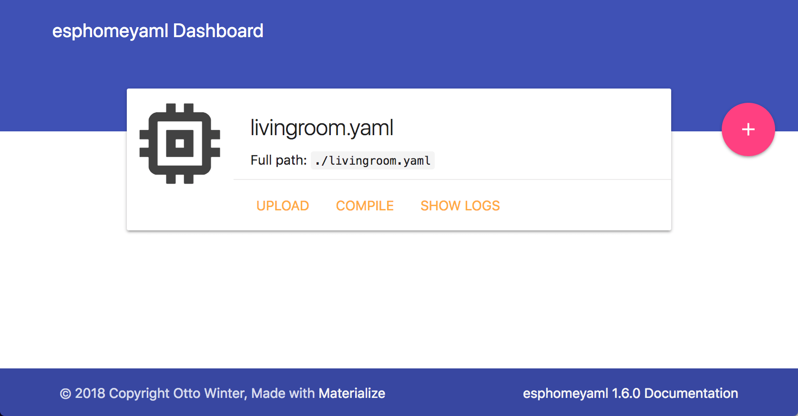

Getting Started with PI4Home
============================

.. seo::
    :description: Getting Started guide for installing PI4Home using the command line and creating a basic configuration.
    :image: console.png

PI4Home is the perfect solution for creating custom firmwares for
your ESP8266/ESP32 boards. In this guide we’ll go through how to setup a
basic “node” in a few simple steps.

Installation
------------

Installing PI4Home is very easy. All you need to do is have `Python
2.7 <https://www.python.org/download/releases/2.7/>`__ installed
(because of platformio 😕) and install the console script script through
``pip``.

.. code-block:: bash

    pip install pi4home

Alternatively, there’s also a docker image available for easy
installation (the docker hub image is only available for amd64 right now; if you have
an RPi, please install PI4Home through ``pip`` or use :doc:`the Hass.io add-on <getting_started_hassio>`:

.. code-block:: bash

    docker pull pi4home/pi4home

Creating A Project
------------------

Now let’s setup a configuration file. Fortunately, PI4Home has a
friendly setup wizard that will guide you through creating your first
configuration file. For example, if you want to create a configuration
file called ``livingroom.yaml``:

.. code-block:: bash

    pi4home livingroom.yaml wizard
    # On Docker:
    docker run --rm -v "${PWD}":/config -it pi4home/pi4home livingroom.yaml wizard

At the end of this step, you will have your first YAML configuration
file ready. It doesn't do much yet and only makes your device connect to
the WiFi network, but still it’s a first step.

Adding some features
--------------------

So now you should have a file called ``livingroom.yaml`` (or similar).
Go open that file in an editor of your choice and let’s add a :doc:`simple
GPIO switch </components/switch/gpio>` to our app.

.. code-block:: yaml

    switch:
      - platform: gpio
        name: "Living Room Dehumidifier"
        pin: 5

The configuration format should hopefully immediately seem similar to
you. PI4Home has tried to keep it as close to Home Assistant’s
``configuration.yaml`` schema as possible. In the above example, we’re
simply adding a switch that’s called “Living Room Dehumidifier” (could control
anything really, for example lights) and is connected to pin ``GPIO5``.
The nice thing about PI4Home is that it will automatically also try
to translate pin numbers for you based on the board. For example in the
above configuration, if using a NodeMCU board, you could have just as
well set ``D1`` as the ``pin:`` option.

First Uploading
---------------

Now you can go ahead and add some more components. Once you feel like
you have something you want to upload to your ESP board, simply plug in
the device via USB and type the following command (replacing
``livingroom.yaml`` with your configuration file):

.. code-block:: bash

    pi4home livingroom.yaml run

You should see PI4Home validating the configuration and telling you
about potential problems. Then PI4Home will proceed to compile and
upload the custom firmware. You will also see that PI4Home created a
new folder with the name of your node. This is a new platformio project
that you can modify afterwards and play around with.

If you are running docker on Linux you can add ``--device=/dev/ttyUSB0``
to your docker command to map a local USB device.

.. code-block:: bash

    docker run --rm -v "${PWD}":/config --device=/dev/ttyUSB0 -it pi4home/pi4home livingroom.yaml compile

Now when you go to the Home Assistant "Integrations" screen (under "Configuration" panel), you
should see the PI4Home device show up in the discovered section (can take up to 5 minutes).
Alternatively, you can manually add the device by clicking "CONFIGURE" on the PI4Home integration
and entering "<NODE_NAME>.local" as the host.

.. figure:: /components/switch/images/gpio-ui.png
    :align: center

After the first upload, you will probably never need to use the USB
cable again, as all features of PI4Home are enabled remotely as well.
No more opening hidden boxes stowed in places hard to reach. Yay!

Adding A Binary Sensor
----------------------

Next, we’re going to add a very simple binary sensor that periodically
checks a GPIO pin whether it’s pulled high or low - the :doc:`GPIO Binary
Sensor </components/binary_sensor/gpio>`.

.. code-block:: yaml

    binary_sensor:
      - platform: gpio
        name: "Living Room Window"
        pin:
          number: 16
          inverted: True
          mode: INPUT_PULLUP

This is an advanced feature of PI4Home. Almost all pins can
optionally have a more complicated configuration schema with options for
inversion and pinMode - the :ref:`Pin Schema <config-pin_schema>`.

This time when uploading, you don’t need to have the device plugged in
through USB again. The upload will magically happen “over the air”.
Using PI4Home directly, this is the same as from a USB cable, but
for docker you need to supply an additional parameter:

.. code-block:: bash

    pi4home livingroom.yaml run
    # On docker
    docker run --rm -v "${PWD}":/config -it pi4home/pi4home livingroom.yaml run

.. figure:: /components/binary_sensor/images/gpio-ui.png

Where To Go Next
----------------

Great 🎉! You’ve now successfully setup your first PI4Home project
and uploaded your first PI4Home custom firmware to your node. You’ve
also learned how to enable some basic components via the configuration
file.

So now is a great time to go take a look at the :doc:`Components Index </index>`.
Hopefully you’ll find all sensors/outputs/… you’ll need in there. If you’re having any problems or
want new features, please either create a new issue on the `GitHub issue
tracker <https://github.com/khzd/pi4home/issues/issues>`__ or find us on the
`Discord chat <https://discord.gg/KhAMKrd>`__ (also make sure to read the :doc:`FAQ <faq>`).

Bonus: PI4Home dashboard
------------------------

PI4Home features a dashboard that you can use to easily manage your nodes
from a nice web interface. It was primarily designed for
:doc:`the Hass.io add-on <getting_started_hassio>`, but also works with a simple command on
\*nix machines (sorry, no windows).

To start the PI4Home dashboard, simply start PI4Home with the following command
(with ``config/`` pointing to a directory where you want to store your configurations)

.. code-block:: bash

    # Install dashboard dependencies
    pip2 install tornado esptool
    pi4home config/ dashboard

    # On docker, host networking mode is required for online status indicators
    docker run --rm --net=host -v "${PWD}":/config -it pi4home/pi4home

After that, you will be able to access the dashboard through ``localhost:6052``.

See Also
--------

- :doc:`PI4Home index </index>`
- :doc:`getting_started_hassio`
- :ghedit:`Edit`

.. disqus::
